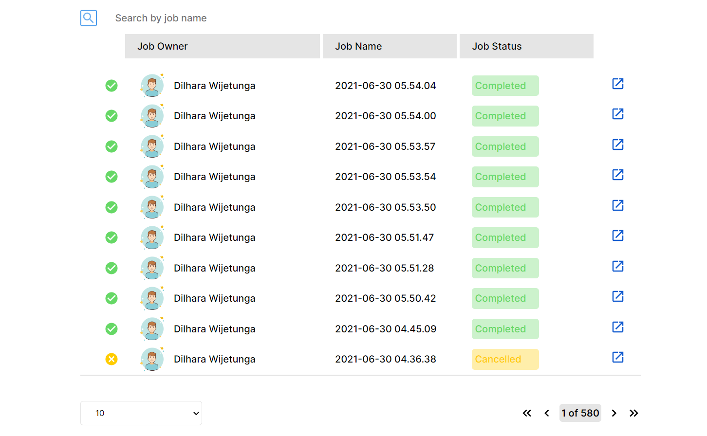
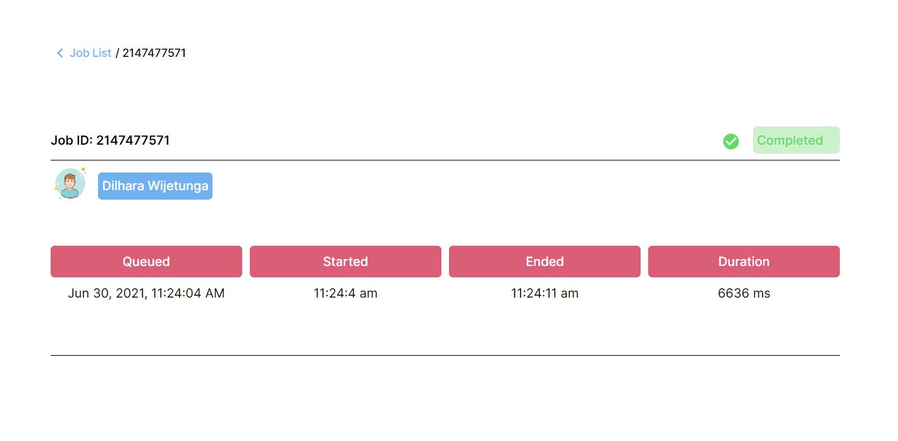

# Job list with Pagination

This program is designed to retrieve job data from a REST API, fetch the data by pages, and display it in a table.

## Installation

Clone down this repository. You will need node and npm installed globally on your machine.

Use the following npm command to install node packages. [Vite](https://vitejs.dev/guide/) build tool was used in the development stages.

```bash
npm install
    or
yarn install
```

Use the following command to run the system. Make sure the backend is running on the system.

```bash
npm run dev
```

## Project screen shots

After successfully run the application with the backend, able to view the below screen

Example :





User or a certain organization can view the status of the job which was assigned to the employees. Meanwhile he/she can filter the jobs using job name.

## License

[MIT](https://choosealicense.com/licenses/mit/)
